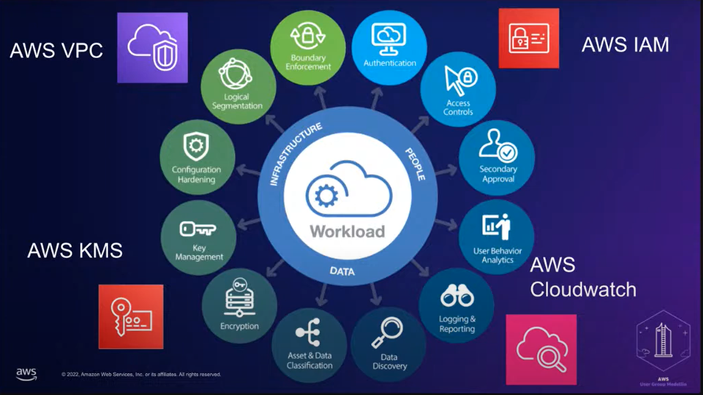
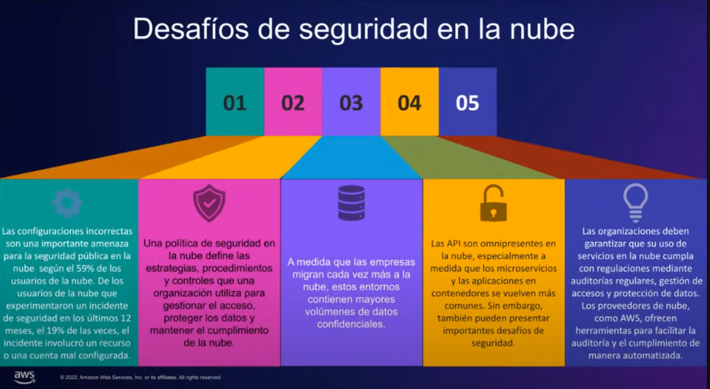
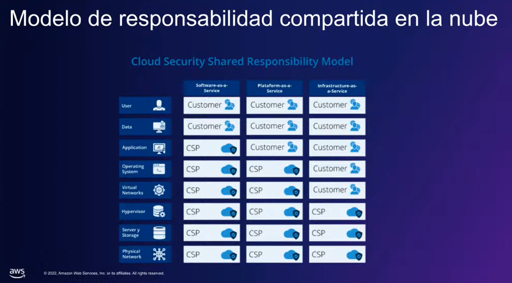
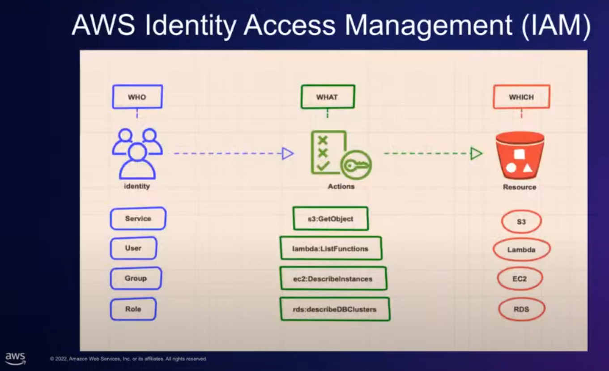
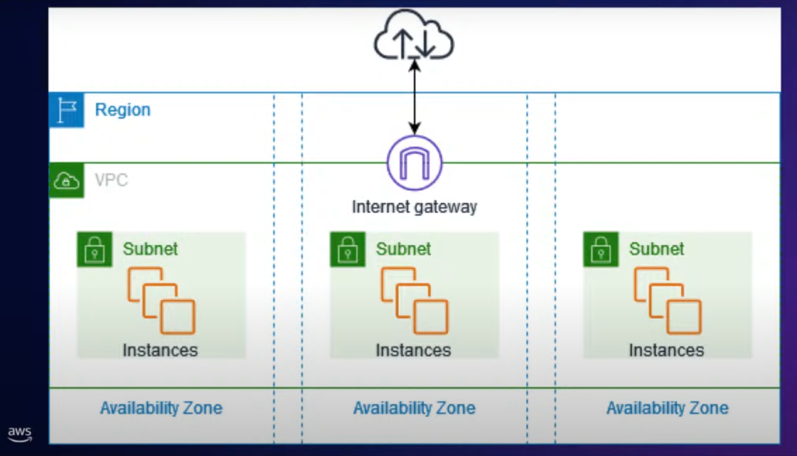
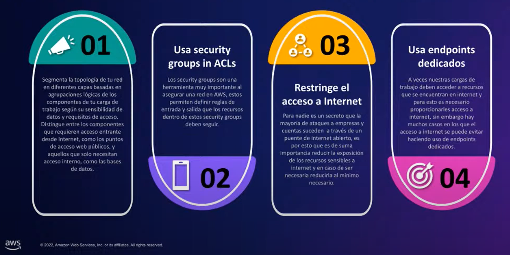
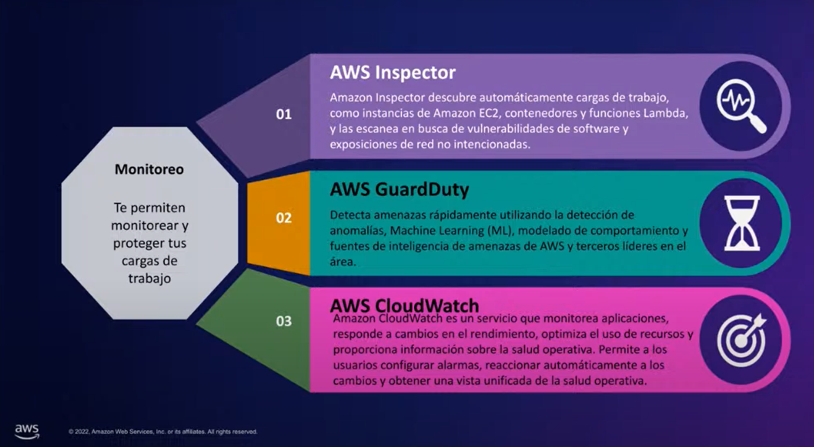
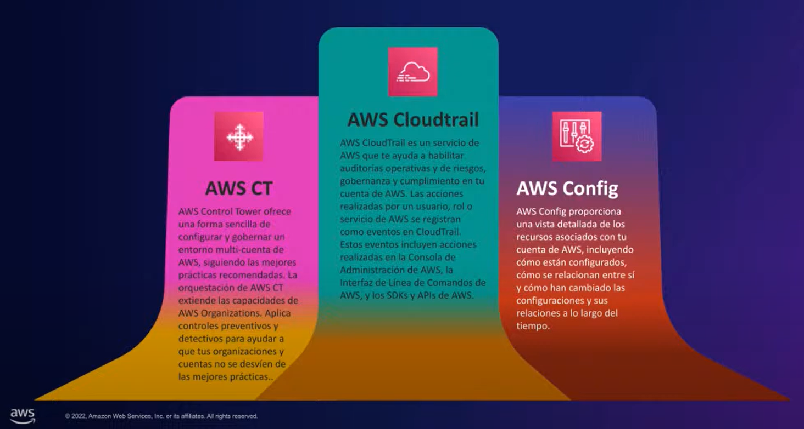

# Protegiendo tu infrastructura - Mejores Prácticas de seguridad en la nube con AWS

> **Nota:** Toda información aquí es copiada de una charla hecha en la comunidad** AWS User Group Medellín** por el speaker **Leonardo Baron**.
> Pedí el permiso correspondiente para poder poner la información aquí en el repositorio de nuestra comunidad.
> - [Redes sociales de la comunidad AWS User Group Medellín](https://linktr.ee/awsugmed "Redes sociales de la comunidad AWS User Group Medellín")
> - [Link de la charla en Yotube](https://www.youtube.com/watch?v=tqEolntK4qg&t=2s "Link de la charla en Yotube")
> - [LinkedIn de Leonardo Baron](https://www.linkedin.com/in/leonardo-baron-a7062118a/ "LinkedIn de Leonardo Baron")

## Contenido de la charla:
- Principios básicos de seguridad en la nube.
- Desafíos de seguridad en la nube.
- Modelo de responsabilidad compartida en la nube.
- Gestión de identidades y acceso (AWS IAM).
- Protección de datos.
- Gestión segura de claves de cifrado (AWS KMS).
- Seguridad en la red (AWS VPC).
- Proteger tu carga de trabajo en AWS.
- Detección de amenzas.
- Cumplimiento y auditoría.

### Principios básicos de seguridad en la nube:

En el medio podemos ver que hay treas áreas generales, y que para cada una de estas áreas tenemos servicios de AWS especializados en abordarlas:
- **Área de personas:**
	- **Authentication:** habilidad que tiene un sistema de **identificar y reconocer identidades**(personas, sistemas, servicios, cargas de trabajo).
	- **Access Controls:** va un poco más allá de las identidades, es cómo se tiene control del control de acceso al sistema, hace referencia a: **Qué acciones puede hacer, cierta identidad dentro de mi sistema**.
	- **Secondary approval:** básciamente es que una identidad tengan permisos para hacer cualquier acción, pero esa acción no siempre tiene que ser una acción total, puede ser una **acción parcial, que necesite de segunda aprobación** para poder terminar de realizarla.
*Nota: Estos tres conceptos se nos hacen posible a través del servicio AWS IAM(Identity Access and Management)*
- **Áreas de datos:**
	- **User Behavior Analytics:** hace referencia a las analíticas del comportamiento de usuario, monitorear **cómo se comporta un usuario dentro de nuestra aplicación** y podemos ver en qué áreas hay **oportunidades de mejora** y cómo podemos hacerlo.
	- ** Logging & Reporting:** cómo se comportan nuestras cargas de trabajo, si están haciendo bien las cosas, si están fallando, si están tomando más tiempo del necesario, y entre muchas otras cosas que podemos **monitorear en nuestras cargas de trabajo**.
	- **Data Discover:** descubrir mucha cantidad de data, para poder monitorearla y analizarla.
	- **Asset & Data Classification:** si se tienen muchos datos, se puede tener la flexibilidad para poder **organizar y clasificar los datos** como se quiera y se necesite. También puedes asegurar cierta data que consideres importante.
	- **Encryption:** **para poder cifrar algo**, necesito una llave para poder cifrarlo. Se puede cifrar la data en reposo y en tránsito.
	- **Key Management:** para **administrar, crear, compartir llaves**, podemos usar KMS (Key Management System).
*Nota: Estos conceptos se nos hacen posible a través del servicio AWS CloudWatch, nos permite descubrir la data, loggings, hacer reportes de cómo se manejan nuestras cargas de trabajo, sacar métricas, entre otras funcionalidades.*

- **Áreas de infrastructura:**
	- **Configuration Hardening:** cada uno de **los recursos** que creamos en un ambiente en cloud, debemos **configurarlos de manera correcta** para que funcione como queremos, y esperamos, de manera segura. Es muy importante saber qué configraciones tenemos disponibles en nuestros recursos, saber cómo funcionan cada una de las configuraciones, y saber cuáles son las que nos sirven para nuestros casos de uso
	- **Logical Segmentation:** una red se compone de subredes, y estas subredes buscamos que se segmenten lógicamente, es decir, que **los elementos que estén relacionados estén sobre la misma subred**, para tener una infrastructura segura.
	- **Boundary Enforcement:** enforcamiento de barreras, queremos que nuestro sistema tenga barreras, y que sólo pueda hacer lo que necesite hacer (**Principio de menor privilegio)**.
*Nota: AWS Config nos permite haer una configuración general, y hacer que esa configuracion general varios recursos la usen (configuration hardening).
AWS VPC nos permite crear una red privada, en una nube de AWS y configurarla de la manera que necesitemos.*

### Desafíos de seguridad en la nube:

### Modelo de responsabilidad compartida en la nube:

### Gestión de identidades y acceso (AWS IAM):
- La gestión de identidades y accesos, o IAM, es la disciplina de seguridad que hace posible que la entidades correctas (personas o cosas) usen los recursos correctos (aplicaciones o datos) cuando los necesitan, sin interferencias, usando los dispositivos que quieran utilizar. IAM se compone de los sistemas y procesos que permiten a los administradores de TI asignar una identidad digital única a cada entidad, autenticarlos cuando inician sesión, autorizarlos para acceder a recursos específicos y monitorear y administrar esas identidades a lo largo de su ciclo de vida.

- Anatomía de un recurso de IAM:
	- **Statement**: descripción de un permiso específico (Qué se puede hacer, sobre qué recurso).
	- **Política**: conjunto de statements (customer managed o aws managed).
	- **Role**: entidad que reúne políticas que pueden ser asociada a un usuario o a un servicio para darle los permisos descritos en sus políticas.
	- **Groups**: entidad que reúne políticas a la que se pueden agregar usuarios. Los usuarios dentro de un grupo obtendrán las políticas asociadas al grupo (similar a un role).
- Mejores prácticas en IAM:

### Protección de datos:
La protección de datos es un pilar fundamental de la seguridad en la nube, hay una variedad de estrategias para asegurar nuestros datos de acceso no autorizado, algunas de ellas son:
1. **Clasificación de datos**: la clasificación de datos proporciona una forma de categorizar los datos organizacionales en función de su criticidad y sensibilidad.
2. **Cifrado en reposo**: la encriptación es una forma de transformar contenido de manera que se vuelva ilegible sin una clave secreta necesaria para descifrar el contenido de vuelta a texto plano.
3. **Cifrado en transito**: diseña tu carga de trabajo para utilizar protocolos de red seguros y autenticados siempre que te comuniques entre servicios, aplicaciones o usuarios.

### Gestión segura de claves de cifrado (AWS KMS):
Un cifrado es solo tan seguro como la seguridad de la clave que fue usada. AWS Key Management Service (AWS KMS) es un servicio adminsitrado que facilita la creación y el control de las claves criptográficas que se utilizan para proteger tus datos. AWS KMS utiliza módulos de seguridad de hardware (HSM)  para proteger y validar tus claves de AWS KMS.

### Seguridad en la red (AWS VPC):
Los usuarios, tanto en tu fuerza laboral como en tus clientes, pueden estar ubicados en cualquier lugar. Necesitas cambiar de los modelos tradicionales que confían en cualquier persona y en cualquier cosa que tenga acceso a tu red. Al seguir el principio de aplicar seguridad en todos los niveles, empleamos un enfoque de Zero Trust. La seguridad Zero Trust es un modelo donde los componentes de la aplicación o los microservicios se consideran discretos entre sí y ningún componente o microservicio confía en otro.

Mejores prácticas para configurar una VPC:

### Proteger tu carga de trabajo en AWS:

### Detección de amenzas:

### Cumplimiento y auditoría:

